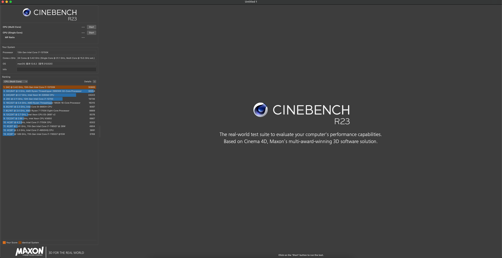

# 技嘉Z690 Aorus Elite AX ddr4 黑苹果EFI
该主板不同修订版本在板载无线网卡方面有一些差别：
* ddr4 rev 1.0：     Intel AX201
* ddr4 rev 1.1/1.2： Intel AX200
* ddr4 rev 1.3/1.4： Intel AX210(Wi-Fi 6E)
* ddr4 V2 rev 1.0:   Intel Ax210(Wi-Fi 6E)

[English(todo)](/README_EN.md)

P core 5.5Ghz，E core 4.3Ghz，Ring 4.8Ghz，R23跑分：


## 注意：
1. 该EFI同样支持Z690 Aorus Elite ddr4，但因为板载网卡被我用SSDT-DAX200.aml屏蔽了，这个SSDT只适用于ax版，所以要把SSDT-DAX200.aml关掉。
2. Z690 Aorus Elite/Elite AX ddr5的USB端口有一点细微差别，不推荐使用。

## 我的配置
| 组件 | 型号 |
| --- | --- |
| CPU | 13th Gen Intel(R) Core(TM) i7-13700K |
| 主板 | 技嘉Z690 Aorus Elite AX ddr4  |
| 显卡 | 技嘉6800XT 超级雕 |
| 内存 | 英睿达铂胜DDR4 3200MHz 16GBx2 超频至3800Mhz C16|
| Wi-Fi与蓝牙 | Fenvi T919 |
| 硬盘 | 三星PM9A1 2TB(`Windows`), 凯侠RC20(`macOS`)　|
| OpenCore版本 | 0.8.8 |
| macOS版本 | macOS Monterey 13.2.1 (22D68) |

## 哪些东西工作?
1. 几乎所有

## 哪些东西不工作?
1. 睡眠有条件的工作，见[已知问题](#已知问题)。
2. 唤醒后蓝牙有点问题，见[唤醒后的蓝牙问题](#唤醒后的蓝牙问题)。
3. 由于12、13代cpu的核显无法正常驱动，随航不可用。

## 更新日志

### 2022-03-11
1. 更新AppleALC.kext到v1.8.0。 
2. 更新RadeonSensor.kext到v0.3.3。
3. 更新SMCRadeonGPU.kext到v0.3.3。
4. 更新SMCProcessor.kext到v1.3.1。
5. 更新SMCSuperIO.kext到v1.3.1。
6. 更新VirtualSMC.kext到v1.6.4。
7. 更新Lilu.kext到v1.6.4。
8. 更新WhateverGreen.kext到v1.6.4。
9. 更新OpenCore到v0.9.0。
10. 找到[已知问题#1](#已知问题)的解决方法，需在BIOS中设置`Aperture Size`为1024MB。解决方案来自：https://www.tonymacx86.com/threads/gigabyte-z690-aero-g-i5-12600k-amd-rx-6800-xt.317179/page-236#post-2361924

### 2022-01-07
1. 更新Lilu.kext到v1.6.3。
2. 更新WhateverGreen.kext到v1.6.3。
3. 更新AppleALC.kext到v1.7.8
4. 添加两个用于关闭睡眠的aml，默认不开。使用时需要把S3/S4-disable.aml两个aml和_S3/4 to XS3/4两个patch给勾上。

### 2022-01-05
1. 不再需要ADBG。
2. 修复MCHC设备重复导致的冲突，现在所有SSDT都正确加载。
3. 更新OpenCore到v0.8.8。

### 2022-01-02
1. 初始化提交。

## BIOS的相关设置
以下基于默认BIOS设置进行修改。

### 关闭项
1. Secure Boot`【必须】`

### 启用项
1. Internal Graphic设置打开`【必须】`，否则没有Aperture Size
2. Aperture Size设置为1024MB`【必须】`
3. Above 4G Enconding`【必须】`
4. Above 4GB MMIO BIOS assignment`【必须】`
5. Re-Size Bar`【必须】`
6. ERP Ready  `【必须】`
7. VT-D `【必须】`

## 生成你的PlatformInfo`【！！！重要！！！】`
使用这个EFI前需要遵循这个指南：[using-gensmbios](https://dortania.github.io/OpenCore-Post-Install/universal/iservices.html#using-gensmbios)，生成PlatformInfo，然后在opencore配置文件中的`PlatformInfo - Generic`填入。

## 关于CpuTopologyRebuild.kext`【！！！重要！！！】`
这个kext将e-core视为p-core的一个逻辑核心。(推测)在12代异构cpu调度时，提高了p-core的调度机会，带来了单线程的更高性能（因为8C20T时大核心被调度的几率，大于20C20T时的大核心被调度几率）。同样，在虚拟机中，在p-core上调度的几率也会变大，因此虚拟机多核心跑分也会更高。在多线程cpu全吃满时，性能不变。  

所以，如果你的cpu不是大小核架构，关闭这个kext，并且从boot args中移除`-ctrsmt`。

## 关闭啰嗦模式
1. 关闭`Misc - Debug -  AppleDebug`、`Disable WatchDog`、 `ApplePanic`。
2. 移除`boot-args`中的`-v debug=0x100 keepsyms=1`。

## Ventura OTA问题
将MacPro7,1与Ventura一起使用时，无法进行增量macOS更新。要解决此问题，请尝试添加boot args，`revpatch=auto,sbvmm,asset`。

## 关于其他AMD显卡的支持
这个EFI无需修改，支持AMD 6000系列显卡。

对于5000系显卡以及以下，需要做一些小改动，参见[AMD GPUs #](https://dortania.github.io/GPU-Buyers-Guide/modern-gpus/amd-gpu.html#amd-gpus)。

## 关于USB映射
也许你需要做一些小修改才能够适配你的机箱。目前的usb没有映射机箱的usb type c，因为我机箱没有，没有映射网口那一排离网口较远的USB 3.0端口，没有映射板载无线的usb蓝牙端口，见[usb-map](/usb-map.md)。

## 屏蔽其他NVMe硬盘
如果你需要屏蔽一些不支持黑苹果的硬盘，只要打开`ACPI - Add - SSDT-DNVMe.aml`，这会屏蔽插在第一个M.2槽(靠近cpu)的NVMe协议硬盘。

同样，你也可以打开SSDT-DNVMe.aml，修改`_SB_.PC00.PEG0.PEGP`，屏蔽其他NVMe硬盘或者PCIE设备。参见[fixing-nvme](https://dortania.github.io/OpenCore-Post-Install/universal/sleep.html#fixing-nvme)。

## 已知问题
1. ~~BIOS为F8及以下版本，在BIOS中`above 4g encoing`打开时，不会有二次睡眠问题；BIOS在F20及以上版本，二次睡眠死机。所以，如果想要在F20及以上版本正常睡眠，需要在BIOS中关闭`above 4g encoing`，并且设置`Booter - Quirks - ResizeAppleGpuBars`为-1，同时添加一个`boot args`，`npci=0x2000`~~。已找到修复方法。
2. 我的无线网卡是Fenvi T919，纯血免驱卡，~~此前在MSI B660m迫击炮上一切正常~~（也不正常，问题一样，只是没有发现）。但我发现在这块主板上，唤醒睡眠时，有点小问题，详见下一小节。

### 唤醒后的蓝牙问题
问题细节：

1. 从有线鼠标/键盘唤醒时，控制台会报一条关于bluetoothd进程的崩溃报告，导致bluetoothd进程会自动重启，但可以自动重连设备。
2. 从电源键唤醒时，有时bluetoothd似乎进入了死循环，log疯狂输出，导致大量cpu占用。此时之前连接的蓝牙设备显示连接上，但不能正常工作，需要手动关闭/打开蓝牙，才能恢复。
3. MacOS Monterey、MacOS Ventura上才有这两个问题，MacOS Big Sur一切正常。
4. 睡眠前自动关闭蓝牙可以bypass这个问题。
5. 我希望有人可以和我一起修复这个问题，而不仅仅是放弃睡眠，或睡眠前关闭蓝牙。

关于问题1，网上有很多相似的帖子：
1. https://www.insanelymac.com/forum/topic/354659-darkwake-from-sleep-monterey-solved/
2. https://www.tonymacx86.com/threads/bluetooth-doesnt-work-after-wake-on-monterey.315679/

关于问题2，网上几乎没有记录。

### 2023-01-02的分析
<details><summary>monterey log（完整日志见bluetooth-issue-log/monterey-2.log）</summary>
<p>

```
...
2023-01-01 15:30:26.019335+0800 0x7b4f     Default     0x0                  0      0    kernel: (IOUSBHostFamily) 000644.572511 HS11@14700000: AppleUSBHostPort::terminateDevice: destroying 0x05e3/0608/6090 (USB2.0 Hub): port is powering off
...
2023-01-01 15:30:26.019385+0800 0x7b50     Default     0x0                  0      0    kernel: (IOUSBHostFamily) 000644.572563 HS12@14800000: AppleUSBHostPort::terminateDevice: destroying 0x05e3/0608/6090 (USB2.0 Hub): port is powering off
2023-01-01 15:30:26.019426+0800 0x7b51     Default     0x0                  0      0    kernel: (IOUSBHostFamily) 000644.572603 HS13@14900000: AppleUSBHostPort::terminateDevice: destroying 0x048d/5702/0001 (ITE Device): port is powering off
...
2023-01-01 15:30:26.048082+0800 0x7aec     Default     0x0                  0      0    kernel: (IOUSBHostFamily) 000644.601259 XHCI@14000000: AppleUSBHostController::hardwareExceptionThreadCallGated: 0x00000100
...
2023-01-01 15:30:26.048399+0800 0x7aec     Default     0x0                  0      0    kernel: (IOUSBHostFamily) 000644.601577 XHCI@14000000: AppleUSBHostController::hardwareExceptionThreadCallGated: attempting recovery
...
2023-01-01 15:30:26.100272+0800 0x7b93     Default     0x0                  0      0    kernel: (IOUSBHostFamily) 000644.653448 AppleUSB20HubPort@14833000: AppleUSBHostPort::terminateDevice: destroying 0x05ac/828d/0150 (Bluetooth USB Host Controller): upstream hub is terminating
2023-01-01 15:30:26.100671+0800 0x7bd1     Default     0x0                  0      0    kernel: (IOUSBHostFamily) 000644.653847 AppleUSB20HubPort@14830000: AppleUSBHostPort::terminateDevice: destroying 0x0a5c/4500/0100 (BRCM20702 Hub): upstream hub is terminating
...
2023-01-01 15:30:26.122630+0800 0x7bdc     Default     0x0                  0      0    kernel: (IOUSBHostFamily) 000644.675805 AppleUSB20HubPort@14820000: AppleUSBHostPort::terminateDevice: destroying 0x1415/2000/0200 (USB Camera-B4.09.24.1): upstream hub is terminating
...
2023-01-01 15:30:26.291615+0800 0x7bd1     Default     0x0                  0      0    kernel: (IOUSBHostFamily) 000644.844790 AppleUSB20HubPort@14810000: AppleUSBHostPort::terminateDevice: destroying 0x045e/028e/0116 (Controller): upstream hub is terminating
...
2023-01-01 15:30:26.292412+0800 0x7bd1     Default     0x0                  0      0    kernel: (IOUSBHostFamily) 000644.845590 AppleUSB20HubPort@14710000: AppleUSBHostPort::terminateDevice: destroying 0x1a81/203e/0116 (USB Keyboard): upstream hub is terminating
2023-01-01 15:30:26.292445+0800 0x7bd2     Default     0x0                  0      0    kernel: (IOUSBHostFamily) 000644.845623 AppleUSB20HubPort@14720000: AppleUSBHostPort::terminateDevice: destroying 0x1532/0085/0200 (Razer Basilisk V2): upstream hub is terminating
...
2023-01-01 15:30:26.299126+0800 0x26c      Default     0x0                  0      0    kernel: (IOUSBHostFamily) 000644.852304 HS13@14900000: AppleUSBHostPort::enumerateDeviceComplete_block_invoke: enumerated 0x048d/5702/0001 (ITE Device) at 12 Mbps
...
2023-01-01 15:30:26.365753+0800 0x26c      Default     0x0                  0      0    kernel: (IOUSBHostFamily) 000644.918930 HS11@14700000: AppleUSBHostPort::enumerateDeviceComplete_block_invoke: enumerated 0x05e3/0608/6090 (USB2.0 Hub) at 480 Mbps
...
2023-01-01 15:30:26.435431+0800 0x26c      Default     0x0                  0      0    kernel: (IOUSBHostFamily) 000644.988610 HS12@14800000: AppleUSBHostPort::enumerateDeviceComplete_block_invoke: enumerated 0x05e3/0608/6090 (USB2.0 Hub) at 480 Mbps
...
2023-01-01 15:30:26.560399+0800 0x18fe     Default     0x0                  0      0    kernel: (IOUSBHostFamily) 000645.113577 Google Chrome@(null): AppleUSBHostUserClient::openGated: could not open provider USB2.0 Hub. provider already opened for exclusive access by a kernel client
2023-01-01 15:30:26.560640+0800 0xedf      Default     0x0                  0      0    kernel: (IOUSBHostFamily) 000645.113818 Android File Tra@(null): AppleUSBHostUserClient::openGated: could not open provider ITE Device. provider already opened for exclusive access by Google Chrome
2023-01-01 15:30:26.560717+0800 0x18fe     Default     0x0                  0      0    kernel: (IOUSBHostFamily) 000645.113895 Google Chrome@(null): AppleUSBHostUserClient::openGated: could not open provider USB2.0 Hub. provider already opened for exclusive access by a kernel client
...
2023-01-01 15:30:26.561150+0800 0xedf      Default     0x0                  0      0    kernel: (IOUSBHostFamily) 000645.114327 Android File Tra@(null): AppleUSBHostUserClient::openGated: could not open provider USB2.0 Hub. provider already opened for exclusive access by a kernel client
2023-01-01 15:30:26.561372+0800 0xedf      Default     0x0                  0      0    kernel: (IOUSBHostFamily) 000645.114550 Android File Tra@(null): AppleUSBHostUserClient::openGated: could not open provider USB2.0 Hub. provider already opened for exclusive access by a kernel client
...
2023-01-01 15:30:26.620944+0800 0x26c      Default     0x0                  0      0    kernel: (IOUSBHostFamily) 000645.174115 AppleUSB20HubPort@14710000: AppleUSBHostPort::enumerateDeviceComplete_block_invoke: enumerated 0x1a81/203e/0116 (USB Keyboard) at 12 Mbps
...
2023-01-01 15:30:26.665565+0800 0x26c      Default     0x0                  0      0    kernel: (IOUSBHostFamily) 000645.218741 AppleUSB20HubPort@14720000: AppleUSBHostPort::enumerateDeviceComplete_block_invoke: enumerated 0x1532/0085/0200 (Razer Basilisk V2) at 12 Mbps
...
2023-01-01 15:30:26.708597+0800 0x26c      Default     0x0                  0      0    kernel: (IOUSBHostFamily) 000645.261775 AppleUSB20HubPort@14810000: AppleUSBHostPort::enumerateDeviceComplete_block_invoke: enumerated 0x045e/028e/0116 (Controller) at 12 Mbps
...
2023-01-01 15:30:26.752462+0800 0x26c      Default     0x0                  0      0    kernel: (IOUSBHostFamily) 000645.305641 AppleUSB20HubPort@14820000: AppleUSBHostPort::enumerateDeviceComplete_block_invoke: enumerated 0x1415/2000/0200 (USB Camera-B4.09.24.1) at 480 Mbps
...
2023-01-01 15:30:26.802207+0800 0x26c      Default     0x0                  0      0    kernel: (IOUSBHostFamily) 000645.355378 AppleUSB20HubPort@14830000: AppleUSBHostPort::enumerateDeviceComplete_block_invoke: enumerated 0x0a5c/4500/0100 (BRCM20702 Hub) at 12 Mbps
2023-01-01 15:30:26.806799+0800 0x7c6d     Default     0x0                  0      0    kernel: (IOUSBHostFamily) 000645.359978 Android File Tra@(null): AppleUSBHostUserClient::start: missing entitlement com.apple.bluetooth.control
2023-01-01 15:30:26.821204+0800 0x369      Default     0x0                  0      0    kernel: (IOUSBHostFamily) 000645.374376 systemstats@(null): AppleUSBHostUserClient::start: missing entitlement com.apple.bluetooth.control
2023-01-01 15:30:26.874700+0800 0x1c6b     Default     0x0                  0      0    kernel: (IOUSBHostFamily) 000645.427878 vmware-usbarbitr@(null): AppleUSBHostUserClient::start: missing entitlement com.apple.bluetooth.control
2023-01-01 15:30:26.882952+0800 0x18fe     Default     0x0                  0      0    kernel: (IOUSBHostFamily) 000645.436130 Google Chrome@(null): AppleUSBHostUserClient::start: missing entitlement com.apple.bluetooth.control
...
2023-01-01 15:30:26.969477+0800 0x4d6      Default     0x0                  0      0    kernel: (IOUSBHostFamily) 000645.522655 airportd@(null): AppleUSBHostUserClient::start: missing entitlement com.apple.bluetooth.control
...
2023-01-01 15:30:27.056576+0800 0x26c      Default     0x0                  0      0    kernel: (IOUSBHostFamily) 000645.609753 AppleUSB20HubPort@14833000: AppleUSBHostPort::enumerateDeviceComplete_block_invoke: enumerated 0x05ac/828d/0150 (Bluetooth USB Host Controller) at 12 Mbps
2023-01-01 15:30:27.057780+0800 0x7c6d     Default     0x0                  0      0    kernel: (IOUSBHostFamily) 000645.610958 Android File Tra@(null): AppleUSBHostUserClient::start: missing entitlement com.apple.bluetooth.control
...
2023-01-01 15:30:27.307559+0800 0x4d6      Default     0x0                  0      0    kernel: (IOUSBHostFamily) 000645.860736 airportd@(null): AppleUSBHostUserClient::start: missing entitlement com.apple.bluetooth.control
2023-01-01 15:30:27.307614+0800 0x1c6b     Default     0x0                  0      0    kernel: (IOUSBHostFamily) 000645.860792 vmware-usbarbitr@(null): AppleUSBHostUserClient::start: missing entitlement com.apple.bluetooth.control
2023-01-01 15:30:27.307668+0800 0x18fe     Default     0x0                  0      0    kernel: (IOUSBHostFamily) 000645.860846 Google Chrome@(null): AppleUSBHostUserClient::start: missing entitlement com.apple.bluetooth.control
2023-01-01 15:30:27.307698+0800 0x369      Default     0x0                  0      0    kernel: (IOUSBHostFamily) 000645.860877 systemstats@(null): AppleUSBHostUserClient::start: missing entitlement com.apple.bluetooth.control
...
2023-01-01 15:30:27.644596+0800 0xedf      Default     0x0                  0      0    kernel: (IOUSBHostFamily) 000646.197774 Android File Tra@(null): AppleUSBHostUserClient::start: missing entitlement com.apple.bluetooth.control
2023-01-01 15:30:27.644726+0800 0xedf      Default     0x0                  0      0    kernel: (IOUSBHostFamily) 000646.197906 Android File Tra@(null): AppleUSBHostUserClient::start: missing entitlement com.apple.bluetooth.control

...
2023-01-01 15:30:42.350515+0800 0x7c03     Error       0x0                  3275   0    bluetoothd: [com.apple.bluetooth:Stack.TRANSPORT] UART open(/dev/cu.BLTH) port failed to appear after 15 seconds (error = Operation timed out)
 (status=65535)
2023-01-01 15:30:42.350584+0800 0x7c03     Default     0x0                  3275   0    bluetoothd: [com.apple.bluetooth:Stack.UNKNOWN] Failed to initialize driver POSIX
2023-01-01 15:30:42.350615+0800 0x7c03     Default     0x0                  3275   0    bluetoothd: [com.apple.bluetooth:Stack.UNKNOWN] Failed to initialize transport H4BC
2023-01-01 15:30:42.350641+0800 0x7c03     Default     0x0                  3275   0    bluetoothd: [com.apple.bluetooth:Stack.UNKNOWN] Transport layer initialization failed
2023-01-01 15:30:42.350664+0800 0x7c03     Default     0x0                  3275   0    bluetoothd: [com.apple.bluetooth:Stack.UNKNOWN] Wake Up Display
2023-01-01 15:30:42.352603+0800 0x7c03     Default     0x0                  3275   0    bluetoothd: [com.apple.bluetooth:PacketLogger.HCI] Terminate sniff
2023-01-01 15:30:42.352802+0800 0x7c03     Default     0x0                  3275   0    bluetoothd: [com.apple.bluetooth:PacketLogger.HCI] Sniff terminated
2023-01-01 15:30:42.352871+0800 0x7c03     Error       0x0                  3275   0    bluetoothd: [com.apple.bluetooth:CBCrash] Bluetooth fatal error - crashing { build=release, reason=1201 }
...
```

</p>
</details>

其中，HS11是后置usb2.0 x4 hub，HS12是内建的usb连接器，HS13是rgb fusion端口。  
唤醒后，IOUSBHostFamily驱动汇报所有的usb端口powering off，包括上面的内建的usb端口、后置usb 2.0 hub、rgb fusion端口。

随后，IOUSBHostFamily驱动在准备恢复端口时，由于上游端口停掉了，所以把BRCM20702 Hub、USB Camera等挂在hub上的设备给停掉了，bluetoothd第一次崩溃。随后重启，默认使用UART transport，然后无法打开/dev/cu.BLTH这个bsd设备文件，超时。15秒后，bluetoothd再次崩溃并重启。此时usb bluetooth controller已经被枚举到了，transport设置为usb，蓝牙功能恢复。  

但实际上，不只是usb hub会报断电，所有的端口都会。相关日志如下：
<details><summary>monterey 更多端口断电log</summary>
<p>

```
2023-01-02 11:15:38.978496+0800 0xd984     Default     0x0                  0      0    kernel: (IOUSBHostFamily) 003115.335042 HS01@14100000: AppleUSBHostPort::terminateDevice: destroying 0x2109/2817/03e3 (USB2.0 Hub             ): port is powering off
2023-01-02 11:15:38.978541+0800 0xd993     Default     0x0                  0      0    kernel: (IOUSBHostFamily) 003115.335086 SS01@14a00000: AppleUSBHostPort::terminateDevice: destroying 0x2109/0817/03e3 (USB3.0 Hub             ): port is powering off
2023-01-02 11:15:38.978546+0800 0xd984     Default     0x0                  0      0    kernel: (IOUSBHostFamily) 003115.335093 SS05@14e00000: AppleUSBHostPort::terminateDevice: destroying 0x0bda/9210/2001 (SSK Storage): port is powering off
2023-01-02 11:15:38.978549+0800 0xd98d     Default     0x0                  0      0    kernel: (IOUSBHostFamily) 003115.335093 SS04@14d00000: AppleUSBHostPort::terminateDevice: destroying 0x0781/5591/0100 (Ultra USB 3.0): port is powering off
2023-01-02 11:15:38.978557+0800 0xd961     Default     0x0                  0      0    kernel: (IOUSBHostFamily) 003115.335101 HS04@14200000: AppleUSBHostPort::terminateDevice: destroying 0x1a81/203e/0116 (USB Keyboard): port is powering off
2023-01-02 11:15:38.978712+0800 0xd99d     Default     0x0                  0      0    kernel: (IOUSBHostFamily) 003115.335258 HS11@14700000: AppleUSBHostPort::terminateDevice: destroying 0x05e3/0608/6090 (USB2.0 Hub): port is powering off
2023-01-02 11:15:38.978740+0800 0xd99e     Default     0x0                  0      0    kernel: (IOUSBHostFamily) 003115.335288 HS12@14800000: AppleUSBHostPort::terminateDevice: destroying 0x05e3/0608/6090 (USB2.0 Hub): port is powering off
2023-01-02 11:15:38.978764+0800 0xd99f     Default     0x0                  0      0    kernel: (IOUSBHostFamily) 003115.335311 HS13@14900000: AppleUSBHostPort::terminateDevice: destroying 0x048d/5702/0001 (ITE Device): port is powering off
2023-01-02 11:15:39.009869+0800 0xda15     Default     0x0                  0      0    kernel: (IOUSBHostFamily) 003115.366414 AppleUSB20HubPort@14720000: AppleUSBHostPort::terminateDevice: destroying 0x1532/0085/0200 (Razer Basilisk V2): upstream hub is terminating
2023-01-02 11:15:39.010168+0800 0xda20     Default     0x0                  0      0    kernel: (IOUSBHostFamily) 003115.366714 AppleUSB20HubPort@14833000: AppleUSBHostPort::terminateDevice: destroying 0x05ac/828d/0150 (Bluetooth USB Host Controller): upstream hub is terminating
2023-01-02 11:15:39.297471+0800 0xda1d     Default     0x0                  0      0    kernel: (IOUSBHostFamily) 003115.654017 AppleUSB20HubPort@14830000: AppleUSBHostPort::terminateDevice: destroying 0x0a5c/4500/0100 (BRCM20702 Hub): upstream hub is terminating
2023-01-02 11:15:39.342823+0800 0xda1d     Default     0x0                  0      0    kernel: (IOUSBHostFamily) 003115.699359 AppleUSB20HubPort@14820000: AppleUSBHostPort::terminateDevice: destroying 0x1415/2000/0200 (USB Camera-B4.09.24.1): upstream hub is terminating
2023-01-02 11:15:39.342938+0800 0xda13     Default     0x0                  0      0    kernel: (IOUSBHostFamily) 003115.699483 AppleUSB20HubPort@14810000: AppleUSBHostPort::terminateDevice: destroying 0x045e/028e/0116 (Controller): upstream hub is terminating
...
2023-01-01 15:30:42.354831+0800 0x7f56     Default     0x0                  507    0    cloudpaird: (CoreUtils) [com.apple.bluetooth:BTServicesDaemon] Bluetoothd has crashed / Restarted

```

</p>
</details>

后置usb type c（SS01、HS01）、后置的usb 3.1端口（SS04、SS05）、后置某个usb 3.0端口的2.0端口（HS04），全部都断电了，

奇怪的是，直接插在后置usb的一些端口上的设备，例如上面插在某个usb 3.0端口的2.0端口（HS04）的USB Keyboard，却没有报错。这也许是因为`AppleUSB20HubPort@14720000: AppleUSBHostPort::terminateDevice`是针对usb hub的代码，不挂在usb hub上的设备。即使usb端口断电，也不会走到这里。  

为了验证这个想法，我又插了一个usb type-c的hub到后置的type-c端口（HS01，SS02）上，然后插了一个usb2.0的有线键盘(USB Keyboard)，一个usb3.0的u盘（Ultra USB 3.0）到typc-c hub上，结果是typc-c hub下面连接的设备，唤醒后也被destroying了。所以说明，即使自己插一个额外的usb hub到usb 端口上，这个usb hub也会有问题。

<details><summary>usb type-c hub端口断电log</summary>
<p>

```
2023-01-02 11:50:59.017856+0800 0x140c4    Default     0x0                  0      0    kernel: (IOUSBHostFamily) 005213.599758 HS01@14100000: AppleUSBHostPort::terminateDevice: destroying 0x2109/2817/03e3 (USB2.0 Hub             ): port is powering off
2023-01-02 11:50:59.018036+0800 0x140c2    Default     0x0                  0      0    kernel: (IOUSBHostFamily) 005213.599937 SS01@14a00000: AppleUSBHostPort::terminateDevice: destroying 0x2109/0817/03e3 (USB3.0 Hub             ): port is powering off
2023-01-02 11:50:59.018145+0800 0x140cb    Default     0x0                  0      0    kernel: (IOUSBHostFamily) 005213.600049 HS11@14700000: AppleUSBHostPort::terminateDevice: destroying 0x05e3/0608/6090 (USB2.0 Hub): port is powering off
2023-01-02 11:50:59.018150+0800 0x140cf    Default     0x0                  0      0    kernel: (IOUSBHostFamily) 005213.600052 HS12@14800000: AppleUSBHostPort::terminateDevice: destroying 0x05e3/0608/6090 (USB2.0 Hub): port is powering off
2023-01-02 11:50:59.018157+0800 0x140c7    Default     0x0                  0      0    kernel: (IOUSBHostFamily) 005213.600058 HS13@14900000: AppleUSBHostPort::terminateDevice: destroying 0x048d/5702/0001 (ITE Device): port is powering off
2023-01-02 11:50:59.020807+0800 0x1406b    Default     0x0                  0      0    kernel: (IOUSBHostFamily) 005213.602710 AppleUSB20HubPort@14720000: AppleUSBHostPort::terminateDevice: destroying 0x1532/0085/0200 (Razer Basilisk V2): port is powering off
2023-01-02 11:50:59.029704+0800 0x14107    Default     0x0                  0      0    kernel: (IOUSBHostFamily) 005213.611607 AppleUSB30HubPort@14a30000: AppleUSBHostPort::terminateDevice: destroying 0x0781/5591/0100 (Ultra USB 3.0): upstream hub is terminating
2023-01-02 11:50:59.031715+0800 0x140e4    Default     0x0                  0      0    kernel: (IOUSBHostFamily) 005213.613616 AppleUSB20HubPort@14140000: AppleUSBHostPort::terminateDevice: destroying 0x1a81/203e/0116 (USB Keyboard): upstream hub is terminating
```

</p>
</details>

同时，这里再附上一些Big Sur的日志。

<details><summary>big sur log（完整日志见bluetooth-issue-log/bigsur.log）</summary>
<p>

```
2023-01-01 16:47:49.017151+0800 0x291d     Default     0x0                  0      0    kernel: (IOUSBHostFamily) 000435.390898 XHCI@14000000: AppleUSBHostController::hardwareExceptionThreadCallGated: 0x00000100
...
2023-01-01 16:47:49.044643+0800 0x291d     Default     0x0                  0      0    kernel: (IOUSBHostFamily) 000435.418392 XHCI@14000000: AppleUSBHostController::hardwareExceptionThreadCallGated: attempting recovery, forcing power state to on
...
2023-01-01 16:47:49.295509+0800 0x1a5b     Default     0x0                  0      0    kernel: (IOUSBHostFamily) 000435.669257 HS13@14900000: AppleUSBHostPort::enumerateDeviceComplete_block_invoke: enumerated 0x048d/5702/0001 (ITE Device)
...
2023-01-01 16:47:49.317261+0800 0x1a5b     Default     0x0                  0      0    kernel: (IOUSBHostFamily) 000435.691010 HS11@14700000: AppleUSBHostPort::enumerateDeviceComplete_block_invoke: enumerated 0x05e3/0608/6090 (USB2.0 Hub)
...
2023-01-01 16:47:49.392479+0800 0x1a5b     Default     0x0                  0      0    kernel: (IOUSBHostFamily) 000435.766226 HS12@14800000: AppleUSBHostPort::enumerateDeviceComplete_block_invoke: enumerated 0x05e3/0608/6090 (USB2.0 Hub)
...
2023-01-01 16:47:49.570937+0800 0x1a5b     Default     0x0                  0      0    kernel: (IOUSBHostFamily) 000435.944686 AppleUSB20HubPort@14710000: AppleUSBHostPort::enumerateDeviceComplete_block_invoke: enumerated 0x1a81/203e/0116 (USB Keyboard)
...
2023-01-01 16:47:49.617412+0800 0x1a5b     Default     0x0                  0      0    kernel: (IOUSBHostFamily) 000435.991160 AppleUSB20HubPort@14720000: AppleUSBHostPort::enumerateDeviceComplete_block_invoke: enumerated 0x1532/0085/0200 (Razer Basilisk V2)
...
2023-01-01 16:47:49.657865+0800 0x1a5b     Default     0x0                  0      0    kernel: (IOUSBHostFamily) 000436.031613 AppleUSB20HubPort@14810000: AppleUSBHostPort::enumerateDeviceComplete_block_invoke: enumerated 0x045e/028e/0116 (Controller)
...
2023-01-01 16:47:49.698403+0800 0x1a5b     Default     0x0                  0      0    kernel: (IOUSBHostFamily) 000436.072151 AppleUSB20HubPort@14820000: AppleUSBHostPort::enumerateDeviceComplete_block_invoke: enumerated 0x1415/2000/0200 (USB Camera-B4.09.24.1)
...
2023-01-01 16:47:49.749106+0800 0x1a5b     Default     0x0                  0      0    kernel: (IOUSBHostFamily) 000436.122854 AppleUSB20HubPort@14830000: AppleUSBHostPort::enumerateDeviceComplete_block_invoke: enumerated 0x0a5c/4500/0100 (BRCM20702 Hub)
...
2023-01-01 16:47:50.000451+0800 0x1a5b     Default     0x0                  0      0    kernel: (IOUSBHostFamily) 000436.374199 AppleUSB20HubPort@14833000: AppleUSBHostPort::enumerateDeviceComplete_block_invoke: enumerated 0x05ac/828d/0150 (Bluetooth USB Host Controller)

```

</p>
</details>

可以看到，big sur并没有一些关于terminate Device的相关报错，唤醒后直接开始枚举usb设备了。  

我简单逆向了一下，`forcing power state to on`这个字符串在monterey的IOUSBHostFamily.kext中并不存在。

所以我猜测：
主板的usb控制器睡眠后有点问题。从S3 state唤醒后，所有的usb端口都被终止，并且只要某个usb hub连接在某个usb端口上，usb hub上的所有设备也会被递归的终止。bluetoothd两次崩溃，这时时间已经到15+秒后了，usb已经重新枚举过了，usb bluetooth controller回来了，cloudpaird守护进程重新拉起bluetooth，恢复正常。

关于为什么按电源键唤醒，有时bluetoothd直接疯狂循环，消耗大量cpu，我认为这可能是唤醒原因不同所导致的，毕竟11.0之后，从有线键鼠设备唤醒需要点按两次，而电源键唤醒只要一次。简单看了log，在hub上的usb设备依旧被终止，没什么不同。Apple一定动了什么东西，后面有时间再分析。

<details><summary>一些从电源键唤醒后bluetoothd循环打印的日志</summary>
<p>

```
2023-01-02 13:11:35.209382+0800 0x1f9fe    Default     0x0                  8243   0    bluetoothd: [com.apple.bluetooth:Stack.LE]  Address rotation in progress:NO
2023-01-02 13:11:35.209400+0800 0x1f9fe    Error       0x0                  8243   0    bluetoothd: [com.apple.bluetooth:Stack.HCI] OI_HCIIfc_SendHciCommand failed (status=1205)
2023-01-02 13:11:35.209419+0800 0x1f9fe    Error       0x0                  8243   0    bluetoothd: [com.apple.bluetooth:Stack.HCI] HCI expected event 14 with opcode OI_DHCI_VENDOR_OPCODE (0x0000FD4A) error, reason is  STATUS 1205
2023-01-02 13:11:35.209438+0800 0x1f9fe    Error       0x0                  8243   0    bluetoothd: [com.apple.bluetooth:Stack.VSC] status 1205, hlCb 0x00A18974
2023-01-02 13:11:35.209458+0800 0x1f9fe    Error       0x0                  8243   0    bluetoothd: [com.apple.bluetooth:Stack.LE] setMultipleAdvParamsCompleteCb Could not start advertising :  STATUS 1205 (status=65535)
2023-01-02 13:11:35.209477+0800 0x1f9fe    Error       0x0                  8243   0    bluetoothd: [com.apple.bluetooth:Stack.VSC] VSC state 1, can not create command
2023-01-02 13:11:35.209496+0800 0x1f9fe    Error       0x0                  8243   0    bluetoothd: [com.apple.bluetooth:Stack.VSC] VSC failed  STATUS 3600
2023-01-02 13:11:35.209515+0800 0x1f9fe    Error       0x0                  8243   0    bluetoothd: [com.apple.bluetooth:Stack.LE] Could not stop the LE advertising BT_VSC_SetMultipleAdvInstanceEnable returned   STATUS 3600 (status=65535)
2023-01-02 13:11:35.209533+0800 0x1f9fe    Error       0x0                  8243   0    bluetoothd: [com.apple.bluetooth:Stack.VSC] VSC state 1, can not create command
2023-01-02 13:11:35.209551+0800 0x1f9fe    Error       0x0                  8243   0    bluetoothd: [com.apple.bluetooth:Stack.VSC] VSC failed  STATUS 3600
2023-01-02 13:11:35.209570+0800 0x1f9fe    Error       0x0                  8243   0    bluetoothd: [com.apple.bluetooth:Stack.LE] Could not stop the LE advertising BT_VSC_SetMultipleAdvInstanceEnable returned   STATUS 3600 (status=65535)
2023-01-02 13:11:35.209588+0800 0x1f9fe    Error       0x0                  8243   0    bluetoothd: [com.apple.bluetooth:Stack.VSC] VSC state 1, can not create command
2023-01-02 13:11:35.209608+0800 0x1f9fe    Error       0x0                  8243   0    bluetoothd: [com.apple.bluetooth:Stack.VSC] VSC failed  STATUS 3600
2023-01-02 13:11:35.209627+0800 0x1f9fe    Error       0x0                  8243   0    bluetoothd: [com.apple.bluetooth:Stack.LE] Could not stop the LE advertising BT_VSC_SetMultipleAdvInstanceEnable returned   STATUS 3600 (status=65535)
2023-01-02 13:11:35.209646+0800 0x1f9fe    Error       0x0                  8243   0    bluetoothd: [com.apple.bluetooth:Stack.VSC] VSC state 1, can not create command
2023-01-02 13:11:35.209663+0800 0x1f9fe    Error       0x0                  8243   0    bluetoothd: [com.apple.bluetooth:Stack.VSC] VSC failed  STATUS 3600
2023-01-02 13:11:35.209681+0800 0x1f9fe    Error       0x0                  8243   0    bluetoothd: [com.apple.bluetooth:Stack.LE] Could not stop the LE advertising BT_VSC_SetMultipleAdvInstanceEnable returned   STATUS 3600 (status=65535)
2023-01-02 13:11:35.209699+0800 0x1f9fe    Default     0x0                  8243   0    bluetoothd: [com.apple.bluetooth:Stack.LE]  Address rotation in progress:NO
2023-01-02 13:11:35.209718+0800 0x1f9fe    Error       0x0                  8243   0    bluetoothd: [com.apple.bluetooth:Stack.LE] failed to start advertising instance 0 with status 1205 . Abort ! Abort ! Abort !
```

</p>
</details>

也许深入学习ACPI可以解决这个问题，也许不能，我会继续尝试。

### 2023-01-04的分析
根据os-y的博文：[usb-fix](https://osy.gitbook.io/hac-mini-guide/details/usb-fix)，与这里蓝牙唤醒的问题可能无关，仅用于个人记录，因为这篇文章真的太有趣了，开发UTM的大佬太强了。

我的理解是：

USB设备会向USB XHCI控制器发送一个中断，将其唤醒。然后XHCI控制器唤醒PCH，PCH通过PCIe接口唤醒处理器。这里USB、LAN、SATA等控制器共享一个GPE（通用事件），多个PCI设备映射到了单个GPE。  

MacOS的OSPM处理逻辑为：
1. 如果存在EC，则GPE被忽略，从EC中获取哪个设备唤醒；
2. 如果不存在EC，则使用GPE，对每个PCI设备枚举PM_Status，放到潜在的唤醒列表中，根据`acpi-wake-type`判断唤醒源，但XHCI设备不再拥有`acpi-wake-type`属性，所以变成了`dark wake`，导致了键盘/鼠标需要双击唤醒。  

同时，100系列芯片组有点问题，PM_Status无法被正确读到。又因为`acpi-wake-type`不再有用，所以osy弄了个假的pci设备，设置了`acpi-wake-type`属性，在唤醒后读不到PM_Status时，用这个假的pci设备让内核认为是用户触发的唤醒，从而直接亮屏，在11.0及以下系统成功bypass了这个问题(尽管不太完美)。  

但随着MacOS 11.0的发布，也有用户反馈这个方法失效了。  
所以我猜测，在600系列主板上，需要两次按键唤醒的原因并不是PM_Status导致的。换句话说，600系列的硬件应该没毛病，通过将`acpi-wake_type`注入到假pci设备的方法失效，并且PCI设备PM_Status不再被枚举，一起导致了这个问题，应该很难解。

又阅读了一下ACPI规范中的[ACPI Waking And Sleep](https://uefi.org/specs/ACPI/6.5/16_Waking_and_Sleeping.html#transitioning-from-the-working-to-the-sleeping-state)，唤醒后OSPM准备系统从睡眠状态转换返回，然后运行_WAK method（这里会有一些notify的调用，内核会处理），再通知本地设备驱动程序从睡眠状态返回。所以我猜测问题可能出在`通知本地设备驱动从睡眠状态返回这里`，IOUSBHostFamily的terminateDevice不知道被内核哪里调用了，可能需要搭一个调试环境。今天依旧没有解决。

### 2023-03-11
建议关闭S3、S4睡眠，或使用[SleepAndAutoBluetoothAndWifi](https://github.com/Mintimate/SleepAndAutoBluetoothAndWifi)，在睡眠前关闭蓝牙。


## References
1. https://github.com/luchina-gabriel/EFI-GIGABYTE-Z690-AORUS-ELITE-AX-12900K-RX6900XT
2. https://www.tonymacx86.com/threads/gigabyte-z690-aero-g-i5-12600k-amd-rx-6800-xt.317179/page-219

## Credits
1. OpenCore
2. Apple
3. [vit9696](https://github.com/vit9696)
4. [CaseySJ](https://github.com/caseysj)
5. [osy](https://github.com/osy)
